## Project - 2 - Traffic Sign Recognition using Deep Learning
In the second project of the Udacity Self-Driving Car course we had to develop traffic sign classification model. This project of the challenged us to classify traffic signs, taken from a dataset of german traffic signs. Click [here](https://github.com/udacity/CarND-Traffic-Sign-Classifier-Project/blob/master/README.md) for the official Udacity readme regarding this project.

This repository contains work towards submisstion for Udacity's Traffic sign classification project which is part of Self-Driving Car Nano Degree Program. This repository contains end-to-end process and steps involved to train a Convolutional Neural Network to identify German Traffic Signs.

Solving this project required training of a deep neural network. I outline the steps I used below. I have achieved an Validation accuracy of 99.5% and a Test accuracy of 95.1%.

#### File set up:

1. Make a main folder for the project
2. Download data from [here](https://d17h27t6h515a5.cloudfront.net/topher/2016/November/581faac4_traffic-signs-data/traffic-signs-data.zip), and put them in a folder called 'TrafficSignData' within the main project folder.
3. Run Traffic_Sign_Classifier_Final.ipynb from the main folder.


The rest of the post is organized as follows,

1. Exploratory Data Analysis
2. Data Augmentation and Preprocessing
3. Class Balancing
3. Model Architecture
4. Training
5. Model Performance on German sign test data and model performance on unseen data

---

### 1. Exploratory Data Analysis (EDA)

First we will familiarize ourselves with the data itself. The German sign data consists of many signs as shown below. We further expect each sign to be present only at relevant locations, therefore there is a difference in number of signs one would expect to see. In this data set the most common sign was the 20 kmph sign. We will not change the relative number of these signs because the incidence rates in the data reflects prior probability of observing a new sign. Leaving relative ratio of images unchanged biases the model towards predicting more frequent sign when the model is unsure between two signs.


```python
#Importing some useful packages
import pickle
import os
import pandas as pd
import seaborn as sns
import tensorflow as tf
from tensorflow.contrib.layers import flatten
from sklearn.utils import shuffle
from sklearn.model_selection import train_test_split
from skimage import transform
import cv2
import numpy as np
import matplotlib.gridspec as gridspec
from sklearn.preprocessing import OneHotEncoder
import time as time
# Load pickled data

training_file = 'TrafficSignData/train.p'
valid_file = 'TrafficSignData/valid.p'
testing_file = 'TrafficSignData/test.p'

with open(training_file, mode='rb') as f:
    train = pickle.load(f)
with open(valid_file, mode='rb') as f:
    valid = pickle.load(f)
with open(testing_file, mode='rb') as f:
    test = pickle.load(f)
    
X_train, y_train = train['features'], train['labels']
X_valid, y_valid = valid['features'], valid['labels']
X_test, y_test = test['features'], test['labels']
```

```python
### Replace each question mark with the appropriate value.

# TODO: Number of training examples
n_train = len(X_train)

# TODO: Number of testing examples.
n_valid = len(X_valid)

# TODO: Number of testing examples.
n_test = len(X_test)

# TODO: What's the shape of an traffic sign image?
image_shape = X_train[0].shape

# TODO: How many unique classes/labels there are in the dataset.
n_classes = np.max(y_train)-np.min(y_train)+1

print("Number of training examples =", n_train)
print("Number of validation examples =", n_train)
print("Number of testing examples =", n_test)
print("Image data shape =", image_shape)
print("Number of classes =", n_classes)
```


        Number of training examples = 34799
        Number of validation examples = 34799
        Number of testing examples = 12630
        Image data shape = (32, 32, 3)
        Number of classes = 43

## The Dataset
The traffic dataset comes from the neuroinformatics institute of the Ruhr-University Bochum ([GTS](benchmark.ini.trub.derub.de)). It consists of 51839 pictures of traffic signs divided into 43 classes. Here is an overview over the different classes and their corresponding number of images.

As can be already seen there are some images which are very hard to classify for a number of different reasons:
1. the size of the images is just 32x32 pixels
2. huge brightness levels between very dark and very bright
3. blurry images (caused by the extraction from a video)

However one of the most important parts of detecting traffic signs in images is already taken care of in this dataset, namely the detection of the traffic sign in the image. All of these are already cropped in order center the traffic sign in the image.


### 2. Data Augmentation and Preprocessing

A big limitation of deep neural networks is that they may have millions of parameters, tuning which requires a vast data set. This however is not always possible. In such cases, data augmentation helps us generate additional training examples. We will generate additional data samples by applying affine transformation to the image. Affine transformations refer to transformations that do not alter the parallelism of lines, i.e. can be represented as a linear operation on the matrix. We will specifically use rotation, shearing and translation to simulate the effect of viewing the sign from different angles and different distances. Figure below presents original image and augmented images generated from it.

```python
def plot_random_3C(n_row,n_col,X,y):

    plt.figure(figsize = (11,8))
    gs1 = gridspec.GridSpec(n_row,n_row)
    gs1.update(wspace=0.01, hspace=0.02) # set the spacing between axes.

    for i in range(n_row*n_col):
        # i = i + 1 # grid spec indexes from 0
        ax1 = plt.subplot(gs1[i])
        plt.axis('on')
        ax1.set_xticklabels([])
        ax1.set_yticklabels([])
        ax1.set_aspect('equal')
        #plt.subplot(4,11,i+1)
        ind_plot = np.random.randint(1,len(y))
        plt.imshow(X[ind_plot])
        plt.text(2,4,str(y[ind_plot]),
             color='k',backgroundcolor='c')
        plt.axis('off')
    plt.show()
def plot_random_1C(n_row,n_col,X,y):

    plt.figure(figsize = (11,8))
    gs1 = gridspec.GridSpec(n_row,n_row)
    gs1.update(wspace=0.01, hspace=0.02) # set the spacing between axes.

    for i in range(n_row*n_col):
        # i = i + 1 # grid spec indexes from 0
        ax1 = plt.subplot(gs1[i])
        plt.axis('on')
        ax1.set_xticklabels([])
        ax1.set_yticklabels([])
        ax1.set_aspect('equal')
        #plt.subplot(4,11,i+1)
        ind_plot = np.random.randint(1,len(y))
        plt.imshow(X[ind_plot],cmap='gray')
        plt.text(2,4,str(y[ind_plot]),
             color='k',backgroundcolor='c')
        plt.axis('off')
    plt.show()   
def plot_random_preprocess(n_row,n_col,X,y):

    plt.figure(figsize = (11,8))
    gs1 = gridspec.GridSpec(n_row,n_row)
    gs1.update(wspace=0.01, hspace=0.02) # set the spacing between axes.

    for i in range(n_row*n_col):
        # i = i + 1 # grid spec indexes from 0
        ax1 = plt.subplot(gs1[i])
        plt.axis('on')
        ax1.set_xticklabels([])
        ax1.set_yticklabels([])
        ax1.set_aspect('equal')
        #plt.subplot(4,11,i+1)
        ind_plot = np.random.randint(1,len(y))
        plt.imshow(pre_process_image(X[ind_plot]),cmap='gray')
        plt.text(2,4,str(y[ind_plot]),
             color='k',backgroundcolor='c')
        plt.axis('off')
    plt.show()


def pre_process_image(image):

    #image = cv2.cvtColor(image, cv2.COLOR_BGR2YUV)
    #image = image[:,:,0]
    image[:,:,0] = cv2.equalizeHist(image[:,:,0])
    image[:,:,1] = cv2.equalizeHist(image[:,:,1])
    image[:,:,2] = cv2.equalizeHist(image[:,:,2])
    image = image/255.-.5
    #image = cv2.resize(image, (img_resize,img_resize),interpolation = cv2.INTER_CUBIC)

    return image
```


```python
plot_random_3C(4,4,X_train,y_train)
```


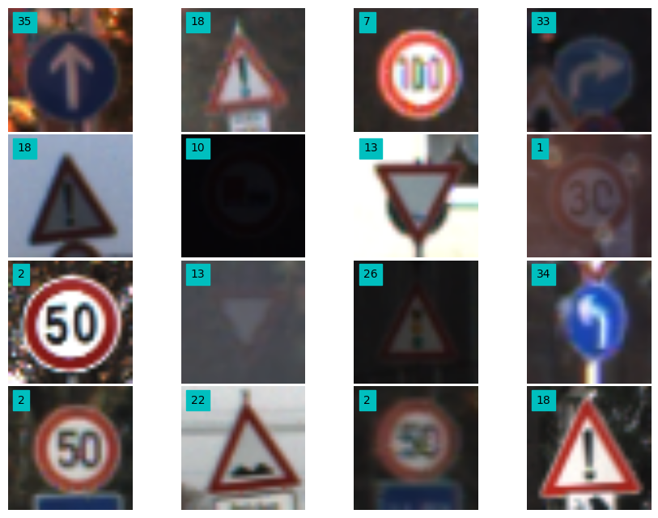


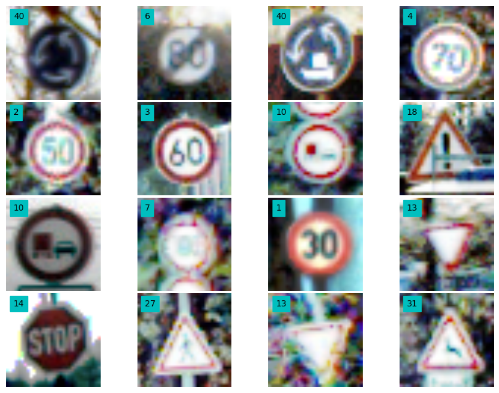


<div>
<table border="1" class="dataframe">
  <thead>
    <tr style="text-align: right;">
      <th></th>
      <th>ClassId</th>
      <th>SignName</th>
      <th>Occurance</th>
    </tr>
  </thead>
  <tbody>
    <tr>
      <th>0</th>
      <td>2</td>
      <td>Speed limit (50km/h)</td>
      <td>2250</td>
    </tr>
    <tr>
      <th>1</th>
      <td>1</td>
      <td>Speed limit (30km/h)</td>
      <td>2220</td>
    </tr>
    <tr>
      <th>2</th>
      <td>13</td>
      <td>Yield</td>
      <td>2160</td>
    </tr>
    <tr>
      <th>3</th>
      <td>12</td>
      <td>Priority road</td>
      <td>2100</td>
    </tr>
    <tr>
      <th>4</th>
      <td>38</td>
      <td>Keep right</td>
      <td>2070</td>
    </tr>
    <tr>
      <th>5</th>
      <td>10</td>
      <td>No passing for vechiles over 3.5 metric tons</td>
      <td>2010</td>
    </tr>
    <tr>
      <th>6</th>
      <td>4</td>
      <td>Speed limit (70km/h)</td>
      <td>1980</td>
    </tr>
    <tr>
      <th>7</th>
      <td>5</td>
      <td>Speed limit (80km/h)</td>
      <td>1860</td>
    </tr>
    <tr>
      <th>8</th>
      <td>25</td>
      <td>Road work</td>
      <td>1500</td>
    </tr>
    <tr>
      <th>9</th>
      <td>9</td>
      <td>No passing</td>
      <td>1470</td>
    </tr>
  </tbody>
</table>
</div>


<div>
<table border="1" class="dataframe">
  <thead>
    <tr style="text-align: right;">
      <th></th>
      <th>ClassId</th>
      <th>SignName</th>
      <th>Occurance</th>
    </tr>
  </thead>
  <tbody>
    <tr>
      <th>33</th>
      <td>39</td>
      <td>Keep left</td>
      <td>300</td>
    </tr>
    <tr>
      <th>34</th>
      <td>29</td>
      <td>Bicycles crossing</td>
      <td>270</td>
    </tr>
    <tr>
      <th>35</th>
      <td>24</td>
      <td>Road narrows on the right</td>
      <td>270</td>
    </tr>
    <tr>
      <th>36</th>
      <td>41</td>
      <td>End of no passing</td>
      <td>240</td>
    </tr>
    <tr>
      <th>37</th>
      <td>42</td>
      <td>End of no passing by vechiles over 3.5 metric ...</td>
      <td>240</td>
    </tr>
    <tr>
      <th>38</th>
      <td>32</td>
      <td>End of all speed and passing limits</td>
      <td>240</td>
    </tr>
    <tr>
      <th>39</th>
      <td>27</td>
      <td>Pedestrians</td>
      <td>240</td>
    </tr>
    <tr>
      <th>40</th>
      <td>37</td>
      <td>Go straight or left</td>
      <td>210</td>
    </tr>
    <tr>
      <th>41</th>
      <td>19</td>
      <td>Dangerous curve to the left</td>
      <td>210</td>
    </tr>
    <tr>
      <th>42</th>
      <td>0</td>
      <td>Speed limit (20km/h)</td>
      <td>210</td>
    </tr>
  </tbody>
</table>
</div>


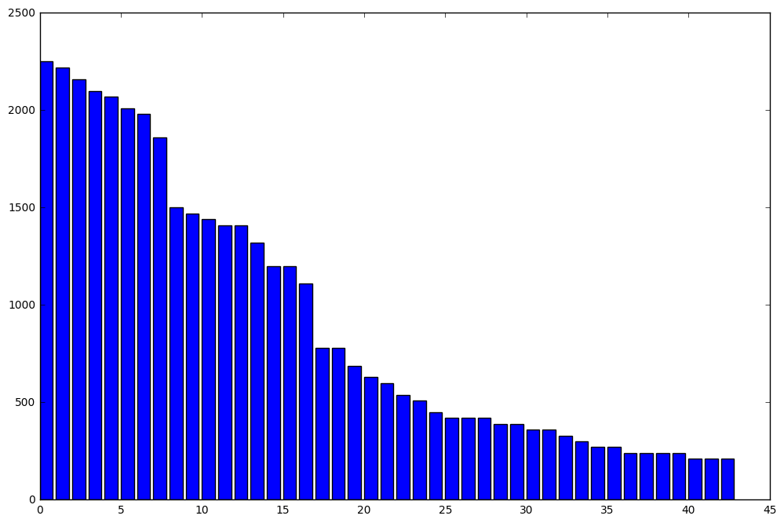


## 3. Class Balancing
I balanced the classes in order to overcome the limitations during classification of under-sampled classes. In order to achieve a uniform class distribution, under-sampled classes were filled with augmented images were I used either a left or right perspective transformation.

### 4. Model Architecture

The first module in the model above is comprised of 3 1X1 filters. These filters have the effect of changing color maps. In most applications, changing color map can result in significant improvements in performance. However, it is not clear what the best color map is for different applications, therefore using 3 1X1 filters results in a case were the network itself ends up choosing the best color map.

The next 3 modules are composed of 32, 64 and 128 (respectively) 3X3 filters followed by maxpooling and dropouts. The output from each of the convolution module is fed into a feedforward layer. Rationale being that the fully connected layer has access to outputs from low level and higher level filters and has the ability to choose the features that works the best. The feedfoward layers are composed of 2 hidden layers with 1024 neurons in each layer. Additional dropout layers are applied after each of the fully connected layers.

The idea of using drop outs heavily is to avoid overfitting and force the network to learn multiple models for the same data.

The last softmax layer is used to compute the log-loss of model prediction. In addition a l2- regularization cost is included to penalize large model weights.


### 5. Training:

We will first start with large augmentation so the model learns overall features of traffic sign, and we will gradually reduce the augmentation to fine tune the model. The training is carried out in the following steps,

1. Generate 10 new images per image in the training set using data augmentation
2. Split data into training and validation sets such that the validation set is 25% of the training set.
3. After first 10 epochs, lower the augmentation by a factor of 0.9 per epoch.


**Additional notes:**

1. *** Hyperparameters***: I chose a learning rate of 1e-3, batch size of 256 and a L-2 regularization on weights of \\( 10^{-5} \\) to avoid overfitting, and ran optimization for a total of 22 epochs.
2. *** Training/validation data***: I generated tranformed data using the technique described in question 1. However, I reduced the augmentation of images as training progressed. The main idea was to provide very noisy data so the neural network can first learn coarse features, and then reduced augmentation to learn finer features. I performed large image augmentations in the initial 4 epochs, and in the next 18 epochs, I reduced augmentation parameters by a factor of 0.9 per epoch.
3. *** Epochs ***: I ran a total of 22 epochs for training the neural network. In each epoch, I trained the model for 20000 iterations in the first 4 epochs, but for 10000 in the following 18 iterations.
3. *** Stopping conditions ***: I used accuracy of validation data as a criteria to monitor if model was overfitting. In the first 4 epochs, I did not use early stopping in the first 4 epochs. But after the first 4 epochs, I stopped training if the validation score didnt improve for 1000 consecutive iterations.

4. *** Optimization ***: I used adamoptimizer with default settings for optimization. The optimization process itself took about 4 hours.


### 5. Model performance:

After training, the performance on German test data was just above 95.0%.


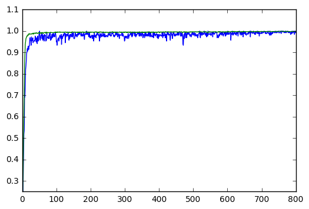


### 5. Model performance on unseen US traffic sign data

The model performs very well on the images that are similar to signs in the German data set. For example, stop sign and do not enter are classified correctly, with high certainty.


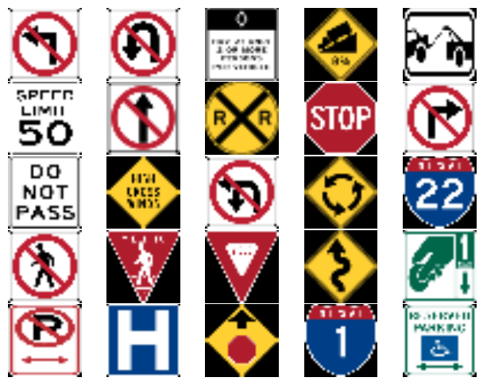


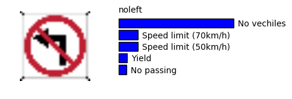


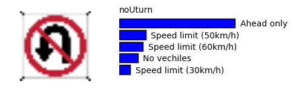


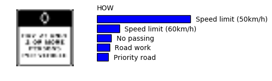


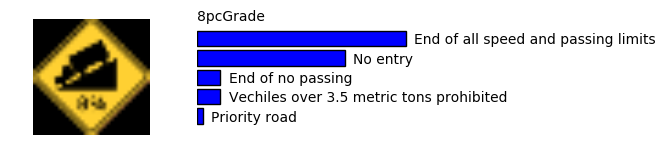


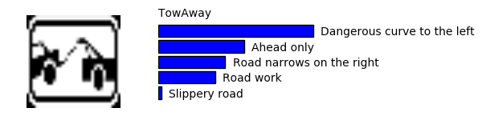


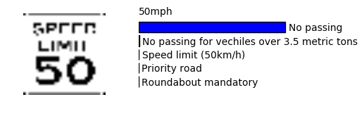


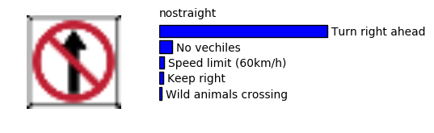


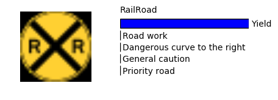


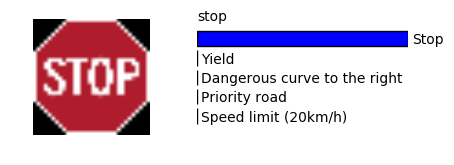


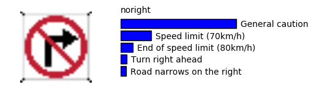


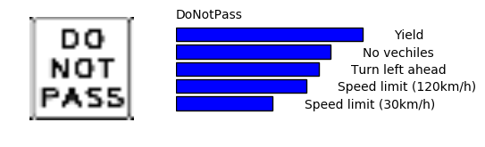


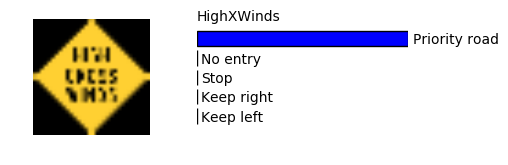


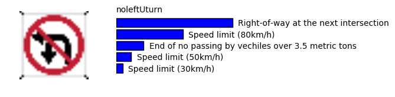


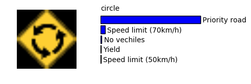


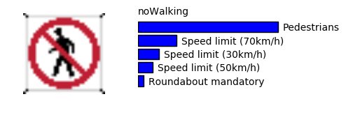


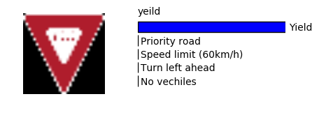


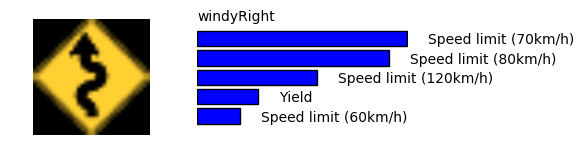


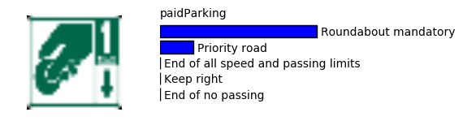


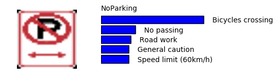


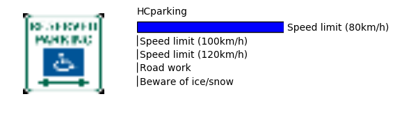


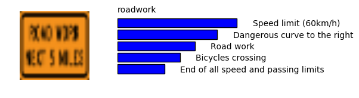


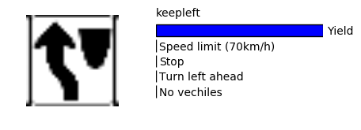


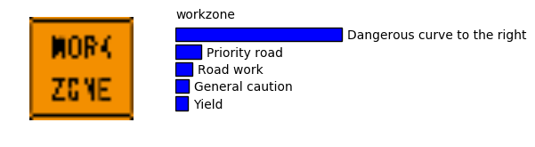


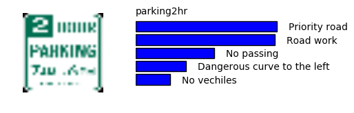


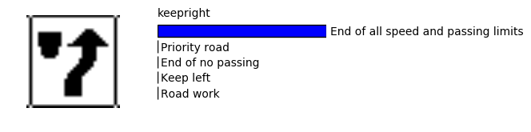


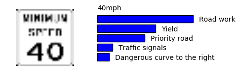


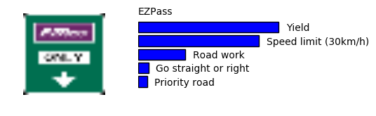


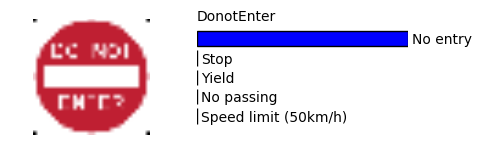


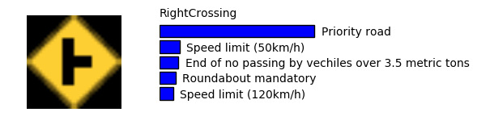


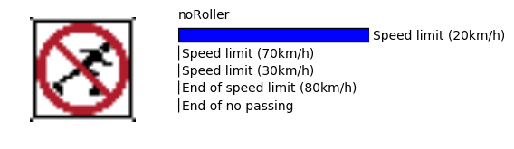


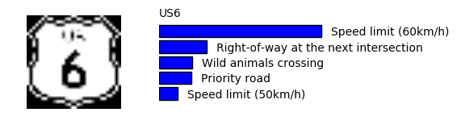


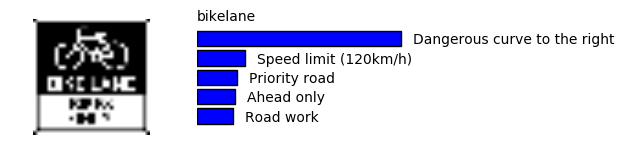


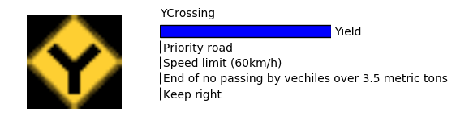


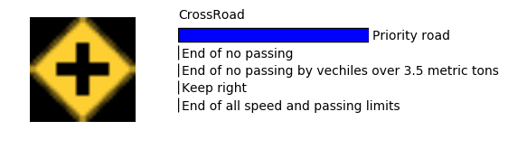


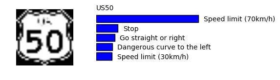
