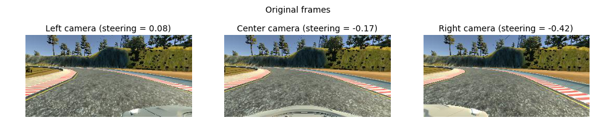
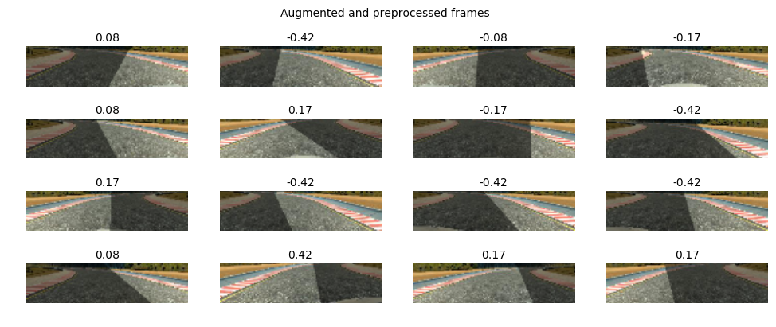

## Project - 3 - Behaviorial Cloning
In this project we have to develop a model which should be able to stear a car autonomously around a simulated track. The objective of this project is to clone human driving behavior using a Deep Neural Network. In order to achieve this, we are going to use a simple Car Simulator provided by Udacity. During the training mode, we navigate our car inside the simulator using the keyboard. While we navigating the car the simulator records training images and respective steering angles. Then we use those recorded data to train our neural network. The simulator had two tracks with training mode and autonomous mode for model development and evaluation. This project makes use of a Udacity-developed driving simulator and training data collected from the simulator (neither of which is included in this repo).

## Training Data
Obtaining 'good' training data was one of the most tricky parts of this projects. I recorded the car on 5 consecutive laps where I tried to stear the car in the center of the road. 2 more Laps were added in which the curves were driven in a very narrow angle and additional recovery data was also recorded. Recovery was performed by stearing towards the edges and before the car could leave the track it was steared back towards the center of the road.

Here are some sample images from the dataset.
<p align="center">
  
</p>

## Project Description

In this project, I use a neural network to clone car driving behavior.  It is a supervised regression problem between the car steering angles and the road images in front of a car.  

Those images were taken from three different camera angles (from the center, the left and the right of the car).  

The network is based on [The NVIDIA model](https://devblogs.nvidia.com/parallelforall/deep-learning-self-driving-cars/), which has been proven to work in this problem domain.

As image processing is involved, the model is using convolutional layers for automated feature engineering.  

### Files included

- model.py The script used to create and train the model.
- drive.py The script to drive the car. You can feel free to resubmit the original drive.py or make modifications and submit your modified version.
- utils.py The script to provide useful functionalities (i.e. image preprocessing and augumentation)
- model.h5 The model weights.
- environments.yml conda environment (Use TensorFlow without GPU)
- environments-gpu.yml conda environment (Use TensorFlow with GPU)

Note: drive.py is originally from [the Udacity Behavioral Cloning project GitHub](https://github.com/udacity/CarND-Behavioral-Cloning-P3) but it has been modified to control the throttle.

## Quick Start

### Install required python libraries:

You need a [anaconda](https://www.continuum.io/downloads) or [miniconda](https://conda.io/miniconda.html) to use the environment setting.

```python
# Use TensorFlow without GPU
conda env create -f environments.yml 

# Use TensorFlow with GPU
conda env create -f environments-gpu.yml
```

Or you can manually install the required libraries (see the contents of the environemnt*.yml files) using pip.

### Run the pretrained model

Start up [the Udacity self-driving simulator](https://github.com/udacity/self-driving-car-sim), choose a scene and press the Autonomous Mode button.  Then, run the model as follows:

```python
python drive.py model.h5
```

### To train the model

You'll need the data folder which contains the training images.

```python
python model.py
```

This will generate a file `model-<epoch>.h5` whenever the performance in the epoch is better than the previous best.  For example, the first epoch will generate a file called `model-000.h5`.

## Model Architecture Design

The design of the network is based on [the NVIDIA model](https://devblogs.nvidia.com/parallelforall/deep-learning-self-driving-cars/), which has been used by NVIDIA for the end-to-end self driving test.  As such, it is well suited for the project.  

It is a deep convolution network which works well with supervised image classification / regression problems.  As the NVIDIA model is well documented, I was able to focus how to adjust the training images to produce the best result with some adjustments to the model to avoid overfitting and adding non-linearity to improve the prediction.

I've added the following adjustments to the model. 

- I used Lambda layer to normalized input images to avoid saturation and make gradients work better.
- I've added an additional dropout layer to avoid overfitting after the convolution layers.
- I've also included ELU for activation function for every layer except for the output layer to introduce non-linearity.

In the end, the model looks like as follows:

- Image normalization
- Convolution: 5x5, filter: 24, strides: 2x2, activation: ELU
- Convolution: 5x5, filter: 36, strides: 2x2, activation: ELU
- Convolution: 5x5, filter: 48, strides: 2x2, activation: ELU
- Convolution: 3x3, filter: 64, strides: 1x1, activation: ELU
- Convolution: 3x3, filter: 64, strides: 1x1, activation: ELU
- Drop out (0.5)
- Fully connected: neurons: 100, activation: ELU
- Fully connected: neurons:  50, activation: ELU
- Fully connected: neurons:  10, activation: ELU
- Fully connected: neurons:   1 (output)

As per the NVIDIA model, the convolution layers are meant to handle feature engineering and the fully connected layer for predicting the steering angle.  However, as stated in the NVIDIA document, it is not clear where to draw such a clear distinction.  Overall, the model is very functional to clone the given steering behavior.  

The below is an model structure output from the Keras which gives more details on the shapes and the number of parameters.

| Layer (type)                   |Output Shape      |Params  |Connected to     |
|--------------------------------|------------------|-------:|-----------------|
|lambda_1 (Lambda)               |(None, 66, 200, 3)|0       |lambda_input_1   |
|convolution2d_1 (Convolution2D) |(None, 31, 98, 24)|1824    |lambda_1         |
|convolution2d_2 (Convolution2D) |(None, 14, 47, 36)|21636   |convolution2d_1  |
|convolution2d_3 (Convolution2D) |(None, 5, 22, 48) |43248   |convolution2d_2  |
|convolution2d_4 (Convolution2D) |(None, 3, 20, 64) |27712   |convolution2d_3  |
|convolution2d_5 (Convolution2D) |(None, 1, 18, 64) |36928   |convolution2d_4  |
|dropout_1 (Dropout)             |(None, 1, 18, 64) |0       |convolution2d_5  |
|flatten_1 (Flatten)             |(None, 1152)      |0       |dropout_1        |
|dense_1 (Dense)                 |(None, 100)       |115300  |flatten_1        |
|dense_2 (Dense)                 |(None, 50)        |5050    |dense_1          |
|dense_3 (Dense)                 |(None, 10)        |510     |dense_2          |
|dense_4 (Dense)                 |(None, 1)         |11      |dense_3          |
|                                |**Total params**  |252219  |                 |


## Data Preprocessing

### Image Sizing

- the images are cropped so that the model won’t be trained with the sky and the car front parts
- the images are resized to 66x200 (3 YUV channels) as per NVIDIA model
- the images are normalized (image data divided by 127.5 and subtracted 1.0).  As stated in the Model Architecture section, this is to avoid saturation and make gradients work better)


## Model Training

### Image Augumentation and Pre-Processing

For training, I used the following augumentation technique along with Python generator to generate unlimited number of images:

- Randomly choose right, left or center images.
- For left image, steering angle is adjusted by +0.2
- For right image, steering angle is adjusted by -0.2
- Randomly flip image left/right
- Randomly translate image horizontally with steering angle adjustment (0.002 per pixel shift)
- Randomly translate image virtically
- Randomly added shadows
- Randomly altering image brightness (lighter or darker)

Using the left/right images is useful to train the recovery driving scenario.  The horizontal translation is useful for difficult curve handling (i.e. the one after the bridge).

### Camera Angles
Each frame consisted of three images (left, center, right):

Left | Center | Right
:-------------------------:|:-------------------------:|:-------------------------:
||

In my model all three images are used, where the left and the right images have an offset added to their steering angles. I experimented a bit with values between 0.1-0.5 and ended up using +0.25 for the left image and -0.25 for the right image.

### Examples of Image Augumentation

The following is the example transformations:

After balancing ~1 hour worth of driving data we ended up with **7698 samples**, which most likely wouldn't be enough for the model to generalise well. However, as many pointed out, there a couple of augmentation tricks that should let you extend the dataset significantly:

- **Left and right cameras**. Along with each sample we receive frames from 3 camera positions: left, center and right. Although we are only going to use central camera while driving, we can still use left and right cameras data during training after applying steering angle correction, increasing number of examples by a factor of 3.
```python
cameras = ['left', 'center', 'right']
steering_correction = [.25, 0., -.25]
camera = np.random.randint(len(cameras))
image = mpimg.imread(data[cameras[camera]].values[i])
angle = data.steering.values[i] + steering_correction[camera]
```
- **Horizontal flip**. For every batch we flip half of the frames horizontally and change the sign of the steering angle, thus yet increasing number of examples by a factor of 2.
```python
flip_indices = random.sample(range(x.shape[0]), int(x.shape[0] / 2))
x[flip_indices] = x[flip_indices, :, ::-1, :]
y[flip_indices] = -y[flip_indices]
```
- **Vertical shift**. We cut out insignificant top and bottom portions of the image during preprocessing, and choosing the amount of frame to crop at random should increase the ability of the model to generalise.
```python
top = int(random.uniform(.325, .425) * image.shape[0])
bottom = int(random.uniform(.075, .175) * image.shape[0])
image = image[top:-bottom, :]
```
- **Random shadow**. We add a random vertical "shadow" by decreasing brightness of a frame slice, hoping to make the model invariant to actual shadows on the road.
```python
h, w = image.shape[0], image.shape[1]
[x1, x2] = np.random.choice(w, 2, replace=False)
k = h / (x2 - x1)
b = - k * x1
for i in range(h):
    c = int((i - b) / k)
    image[i, :c, :] = (image[i, :c, :] * .5).astype(np.int32)
```

We then preprocess each frame by cropping top and bottom of the image and resizing to a shape our model expects (`32×128×3`, RGB pixel intensities of a 32×128 image). The resizing operation also takes care of scaling pixel values to `[0, 1]`.

```python
image = skimage.transform.resize(image, (32, 128, 3))
```

To make a better sense of it, let's consider an example of a **single recorded sample** that we turn into **16 training samples** by using frames from all three cameras and applying aforementioned augmentation pipeline.

<p align="center">
  
</p>
<p align="center">
  
</p>

Augmentation pipeline is applied using a Keras generator, which lets us do it in real-time on CPU while GPU is busy backpropagating!


## Training, Validation and Test

I splitted the images into train and validation set in order to measure the performance at every epoch.  Testing was done using the simulator.

As for training, 

- I used mean squared error for the loss function to measure how close the model predicts to the given steering angle for each image.
- I used Adam optimizer for optimization with learning rate of 1.0e-4 which is smaller than the default of 1.0e-3.  The default value was too big and made the validation loss stop improving too soon.
- I used ModelCheckpoint from Keras to save the model only if the validation loss is improved which is checked for every epoch.

## Outcome

The model can drive the course without bumping into the side ways.

|Lake Track|Jungle Track|
|:--------:|:------------:|
|[](https://youtu.be/lcc37H6KP-M)|[](https://youtu.be/wLj_JEiGlW4)|
|[YouTube Link](https://youtu.be/lcc37H6KP-M)|[YouTube Link](https://youtu.be/wLj_JEiGlW4)|

