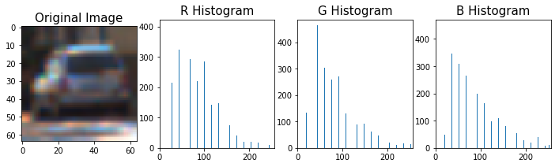

# Self-Driving Car Engineer Nanodegree
## Project - 5 - Vehicle Detection and Tracking

<p align="center">
    
</p>

### **The Goal**
##### _To write a software pipeline to identify vehicles in a video from a front-facing camera on a car._
The goals / steps of this project are the following:

* Perform a Histogram of Oriented Gradients (HOG) feature extraction on a labeled training set of images and train a Linear SVM classifier
    * Optionally, you can also apply a color transform and append binned color features, as well as histograms of color, to your HOG feature vector. 
    * Note: for those first two steps don't forget to normalize your features and randomize a selection for training and testing.
* Implement a sliding-window technique and use your trained classifier to search for vehicles in images.
* Run your pipeline on a video stream (start with the test_video.mp4 and later implement on full project_video.mp4) and create a heat map of recurring detections frame by frame to reject outliers and follow detected vehicles.
* Estimate a bounding box for vehicles detected.

---

### Data

For training, used the datasets provided by Udacity: KITTI-extracted part of 
[vehicles](https://s3.amazonaws.com/udacity-sdc/Vehicle_Tracking/vehicles.zip) and a corresponding number of samples
from [non-vehicles](https://s3.amazonaws.com/udacity-sdc/Vehicle_Tracking/non-vehicles.zip), randomly sampled.

The Final model had difficulties in detecting white Lexus in the Project video, so augmented the dataset with about 200
samples of it. Additionally, used the same random image augmentation technique as in Project 2 for Traffic Signs
Classification, yielding about 1500 images of vehicles from the Project video. The total number of vehicle's images 
used for training, validation and testing was about 7500.

As mentioned above, equal number of non-vehicles images has been added as a negative examples.

---

### Loading and Visualizing the Data

For this project I used the **`vehicle`** (labeled as `car_images`) and **`non-vehicle`** (labeled as `noncar_images`) datasets provided by [Udacity](https://github.com/udacity/CarND-Vehicle-Detection). Below is are 8 random images from the **`vehicle`** and **`non-vehicle`** datasets.

<p align="center">
    
</p>

---

### Histogram of Oriented Gradients (HOG)

### 1. Explain how (and identify where in your code) you extracted HOG features from the training images.

### Function for Converting Image to Histogram of Oriented Gradients (HOG)

The **`get_hog_features`** function takes in an image and computes the Histogram of Oriented Gradient (HOG) features in it using the **`hog()`** function from the [scikit-image](http://scikit-image.org/docs/dev/api/skimage.feature.html?highlight=feature%20hog#skimage.feature.hog) package. Below is the visualization of the **`get_hog_features`** function.

<p align="center">
    
</p>


### Function to Compute Color Histogram Features and Visualization

The **`color_hist`** function computes Color Histogram features labeled **`hist_features`**. This function returns concatenated color channels by default and separate color channels if the **`vis == True`** flag is called. Below is the visualization of the **'R' 'G' and 'B'** channels from a random `car_image`.

<p align="center">
    
</p>


### Function for Spatial Binning of Color Features

The **`bin_spatial`** function takes in an image, a color space, and a new image size and returns a feature vector. Useful for extracting color features from low resolution images. Below is an example of spatially binned color features extracted from an image before and after resizing. 

<p align="center">
    
    
    
    
    
    
</p>


### Function to Extract Features from a List of Images

The method `extract_features` in the section titled "Method to Extract HOG Features from an Array of Car and Non-Car Images" accepts a list of image paths and HOG parameters (as well as one of a variety of destination color spaces, to which the input image is converted), and produces a flattened array of HOG features for each image in the list.

Next, in the section titled "Extract Features for Input Datasets and Combine, Define Labels Vector, Shuffle and Split," I define parameters for HOG feature extraction and extract features for the entire dataset. These feature sets are combined and a label vector is defined (`1` for cars, `0` for non-cars). The features and labels are then shuffled and split into training and test sets in preparation to be fed to a linear support vector machine (SVM) classifier. The table below documents the twenty-five different parameter combinations that I explored.

The **`extract_features`** function etracts the features returned by the **`bin_spatial`**, **`color_hist`** and **`get_hog_features`** functions. Each functions has a `True` flag assigned to it so that the features can be extracted individually or all at once. 

---

#### 2.  Final choice of HOG parameters

I settled on my final choice of HOG parameters based upon the performance of the SVM classifier produced using them. I considered not only the accuracy with which the classifier made predictions on the test dataset, but also the speed at which the classifier is able to make predictions. There is a balance to be struck between accuracy and speed of the classifier, and my strategy was to bias toward speed first, and achieve as close to real-time predictions as possible, and then pursue accuracy if the detection pipeline were not to perform satisfactorily.  

The final parameters chosen were those labeled "configuration 24" in the table above: YUV colorspace, 11 orientations, 16 pixels per cell, 2 cells per block, and `ALL` channels of the colorspace. 

### Training and Testing the HOG Support Vector Classifier

After extracting HOG and color features from the **`car_images`** and **`noncar_images`** I test the accuracy of the SVC by comparing the predictions on labeled `X_train` data. Test Accuracy of HOG based SVC is 96.93% and the test Accuracy of Color Histogram based SVC is 96.71%.

---

### Sliding Window Implementation

### 1. Describe how (and identify where in your code) you implemented a sliding window search. How did you decide what scales to search and how much to overlap windows?

The **`slide_window`** function takes in an image, start and stop positions, window size and overlap fraction and returns a list of bounding boxes for the search windows, which will then be passed to draw boxes. Below is an illustration of the **`slide_window`** function with adjusted `y_start_stop` values [400, 656].

<p align="center">
    
</p>

---

### Function to Extract Features from a Single Image Window

The **`single_img_features`** function is very similar to the *`extract_features`* function. One extracts HOG and color features from a list of images while the other extracts them from one image at a time. The extracted features are passed on to the **`search_windows`** function which searches windows for matches defined by the classifier. The following parameters were used to extact feautures of `cars` and `noncars` from the datasets.

```python

color_space = 'YCrCb' # Can be RGB, HSV, LUV, HLS, YUV, YCrCb
orient = 10  # HOG orientations
pix_per_cell = 8 # HOG pixels per cell
cell_per_block = 2 # HOG cells per block
hog_channel = 'ALL' # Can be 0, 1, 2, or "ALL"
spatial_size = (32, 32) # Spatial binning dimensions
hist_bins = 64   # Number of histogram bins
spatial_feat = True # Spatial features on or off
hist_feat = True # Histogram features on or off
hog_feat = True # HOG features on or off
```
Test Accuracy of SVC is 98.76%

<p align="center">
    
</p>

---

### Adding Heatmaps and Bounding Boxes

### 2. Show some examples of test images to demonstrate how your pipeline is working. What did you do to optimize the performance of your classifier?

The **`add_heat`** function creates a map of positive "car" results found in an image by adding all the pixels found inside of search boxes. More boxes means more "hot" pixels. The **`apply_threshold`** function defines how many search boxes have to overlap for the pixels to be counted as "hot", as a result the "false-positve" search boxes can be discarded. The **`draw_labeled_bboxes`** function takes in the "hot" pixel values from the image and converts them into labels then draws bounding boxes around those labels. Below is an example of these functions at work.

<p align="center">
    
</p>

---

#### 3. SVM classifier using your selected HOG features

In the section titled "Train a Classifier" I trained a linear SVM with the default classifier parameters and using HOG features alone (I did not use spatial intensity or channel intensity histogram features) and was able to achieve a test accuracy of 98.17%. 

###  Function to Predict using Features Extracted from HOG Sub-Sampling

In the section titled "Method for Using Classifier to Detect Cars in an Image" I adapted the method `find_cars` from the lesson materials. The method combines HOG feature extraction with a sliding window search, but rather than perform feature extraction on each window individually which can be time consuming, the HOG features are extracted for the entire image (or a selected portion of it) and then these full-image features are subsampled according to the size of the window and then fed to the classifier. The method performs the classifier prediction on the HOG features for each window region and returns a list of rectangle objects corresponding to the windows that generated a positive ("car") prediction.

The image below shows the first attempt at using `find_cars` on one of the test images, using a single window size:

The **`find_cars`** function extracts the HOG and color features, scales them and then makes predictions. Using multiple scale values allows for more accurate predictions. I have combined scales of **`1.0, 1.5`** and **`2.0`** with their own `ystart` and `ystop` values to lower the ammount of false-postive search boxes. 

---

### Sliding Window Search
I explored several configurations of window sizes and positions, with various overlaps in the X and Y directions. The following four images show the configurations of all search windows in the final implementation, for small (1x), medium (1.5x, 2x), and large (3x) windows:

The final algorithm calls `find_cars` for each window scale and the rectangles returned from each method call are aggregated. In previous implementations smaller (0.5) scales were explored but found to return too many false positives, and originally the window overlap was set to 50% in both X and Y directions, but an overlap of 75% in the Y direction (yet still 50% in the X direction) produced more redundant true positive detections, which were preferable given the heatmap strategy described below. Additionally, only an appropriate vertical range of the image is considered for each window size (e.g. smaller range for smaller scales) to reduce the chance for false positives in areas where cars at that scale are unlikely to appear. The final implementation considers 190 window locations, which proved to be robust enough to reliably detect vehicles while maintaining a high speed of execution.

The image below shows the rectangles returned by `find_cars` drawn onto one of the test images in the final implementation. Notice that there are several positive predictions on each of the near-field cars, and one positive prediction on a car in the oncoming lane.

Because a true positive is typically accompanied by several positive detections, while false positives are typically accompanied by only one or two detections, a combined heatmap and threshold is used to differentiate the two. The `add_heat` function increments the pixel value (referred to as "heat") of an all-black image the size of the original image at the location of each detection rectangle. Areas encompassed by more overlapping rectangles are assigned higher levels of heat. The following image is the resulting heatmap from the detections in the image above.

A threshold is applied to the heatmap (in this example, with a value of 1), setting all pixels that don't exceed the threshold to zero. 

The `scipy.ndimage.measurements.label()` function collects spatially contiguous areas of the heatmap and assigns each a label. And the final detection area is set to the extremities of each identified label. The results of passing all of the project test images through the above pipeline are displayed in the images below:

The final implementation performs very well, identifying the near-field vehicles in each of the images with no false positives. 

The first implementation did not perform as well, so I began by optimizing the SVM classifier. The original classifier used HOG features from the YUV Y channel only, and achieved a test accuracy of 96.28%. Using all three YUV channels increased the accuracy to 98.40%, but also tripled the execution time. However, changing the `pixels_per_cell` parameter from 8 to 16 produced a roughly ten-fold increase in execution speed with minimal cost to accuracy. 

Other optimization techniques included changes to window sizing and overlap as described above, and lowering the heatmap threshold to improve accuracy of the detection (higher threshold values tended to underestimate the size of the vehicle).

---

#### Video Implementation

Here's the [result](./NP_Project_Video_Output_1.mp4)

---

### Results and Discussion

The pipeline is able to correctly lable cars areas on a video frames. Of course, the algorithm may fail in case of difficult light conditions, which could be partly resolved by the classifier improvement. It is possible to improve the classifier by additional data augmentation, hard negative mining, classifier parameters tuning etc.

The algorithm may have some problems in case of car overlaps another. To resolve this problem one may introduce long term memory of car position and a kind of predictive algorithm which can predict where occluded car can be and where it is worth to look for it.

To eliminate false positives on areas out of the road, one can deeply combine results from the Advanced Lane Line finding project to correctly determine the wide ROI on the whole frame by the road boundaries. Unfortunately, it was not correctly implemented (just hard coded, which is enought for the project but not a good implementation for a real-world application) due to time limitation.

The pipeline is not a real-time (about 4 fps with Lane line detection, which independently performs at 9 fps). One can further optimize number of features and feature extraction parameters as well as number of analyzed windows to increase the rate because lane line detection is quite fast.
1. During the creation of this project, I have learned a great deal about color spectrums, image gradients and support vector classifiers. Even though this method of image recognition is not likely to be used in vehicle detection due to it's incredibly slow processing speed it was a great learning tool for me due to its customizability. 
2. In the future I would like to try using deep-learning for vehicle recognition, perhaps using the ["You only look once"](https://pjreddie.com/darknet/yolo/) method.
3. The pipeline used in this project tends to do poorly when areas of the image darken by the presence of shadows. Classifying dark pixels as `cars`, creating false-positives. This issue could be resolved by adding more dark images to the `non-vehicle` dataset.
4. For the purpose of this project, `xstart` and `xstop` could also be implemented as the left outer portion of the frame is mostly useless and creates a lot of false-positives.

---

### Discussion

Thoroughly studied the approach of applying **SVM** classifier to **HOG** features covered it the Project lessons, but 
actually intended to employ the Deep Learning approach even before that. In a CS231n lecture that
I referred to at the beginning, the **HOGs** are actually viewed only from a historical perspective. Furthermore, 
there is a [paper](https://arxiv.org/abs/1409.5403) which argues that the **DPMs** (those are based on **HOGs**) might 
be viewed as a certain type of Convolutional Neural Networks.

It took some time figuring out how to derive a model that would produce the detection map of a reliable resolution when 
expanding it to accept the input image of a fully-sized region of interest.

Even the tiny model takes about 0.75 seconds to produce a detection map for 260x1280x3 input image. That is 1.33 frames per second.
The problems that I faced while implementing this project were mainly concerned with detection accuracy. Balancing the accuracy of the classifier with execution speed was crucial. Scanning 190 windows using a classifier that achieves 98% accuracy should result in around 4 misidentified windows per frame. Of course, integrating detections from previous frames mitigates the effect of the misclassifications, but it also introduces another problem: vehicles that significantly change position from one frame to the next (e.g. oncoming traffic) will tend to escape being labeled. Producing a very high accuracy classifier and maximizing window overlap might improve the per-frame accuracy to the point that integrating detections from previous frames is unnecessary (and oncoming traffic is correctly labeled), but it would also be far from real-time without massive processing power.  

The pipeline is probably most likely to fail in cases where vehicles (or the HOG features thereof) don't resemble those in the training dataset, but lighting and environmental conditions might also play a role (e.g. a white car against a white background). As stated above, oncoming cars are an issue, as well as distant cars (as mentioned earlier, smaller window scales tended to produce more false positives, but they also did not often correctly label the smaller, distant cars). 

I believe that the best approach, given plenty of time to pursue it, would be to combine a very high accuracy classifier with high overlap in the search windows. The execution cost could be offset with more intelligent tracking strategies, such as:
- determine vehicle location and speed to predict its location in subsequent frames
- begin with expected vehicle locations and nearest (largest scale) search areas, and preclude overlap and redundant detections from smaller scale search areas to speed up execution.
